# 🏗️ System Architecture

## 📖 Overview
The Monty project implements a complete stack and queue interpreter for the Monty 0.98 bytecode language, featuring dynamic mode switching, comprehensive arithmetic operations, and integrated Brainf*ck language support. The architecture emphasizes modularity, performance, and robust error handling through a clean separation of concerns between parsing, execution, and data management components.

---

## 🏛️ High-Level Architecture

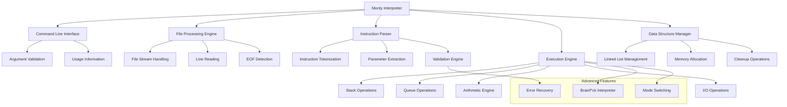

The architecture follows a layered design where each component has clearly defined responsibilities, enabling maintainable code and efficient execution of bytecode instructions.

---

## 🧩 Core Components

### Command Line Interface & Initialization
- **Purpose**: Program entry point and initial setup
- **Technology**: Standard C main function with argument processing
- **Location**: `monty.c` (main function)
- **Responsibilities**:
  - Command line argument validation
  - File accessibility verification
  - Global state initialization
  - Error handling for startup failures

### File Processing Engine
- **Purpose**: Bytecode file reading and line management
- **Technology**: Standard C file I/O with stream processing
- **Location**: `monty.c` (file reading loop)
- **Responsibilities**:
  - File stream opening and management
  - Line-by-line reading with getline()
  - Memory management for line buffers
  - End-of-file detection and cleanup

### Instruction Parser & Dispatcher
- **Purpose**: Bytecode instruction parsing and execution dispatch
- **Technology**: String tokenization with function pointer dispatch
- **Location**: `monty.c` (instruction processing), `helpers.c`
- **Responsibilities**:
  - Instruction tokenization and parameter extraction
  - Instruction validation and error detection
  - Function pointer lookup and dispatch
  - Parameter conversion and validation

### Data Structure Manager
- **Purpose**: Stack and queue implementation with dynamic memory management
- **Technology**: Linked list with malloc/free memory management
- **Location**: `lists.c`, global data management
- **Responsibilities**:
  - Node creation and destruction
  - Stack and queue operations
  - Memory allocation and cleanup
  - Data structure integrity maintenance

---

## 💾 Data Architecture

### Core Data Structures
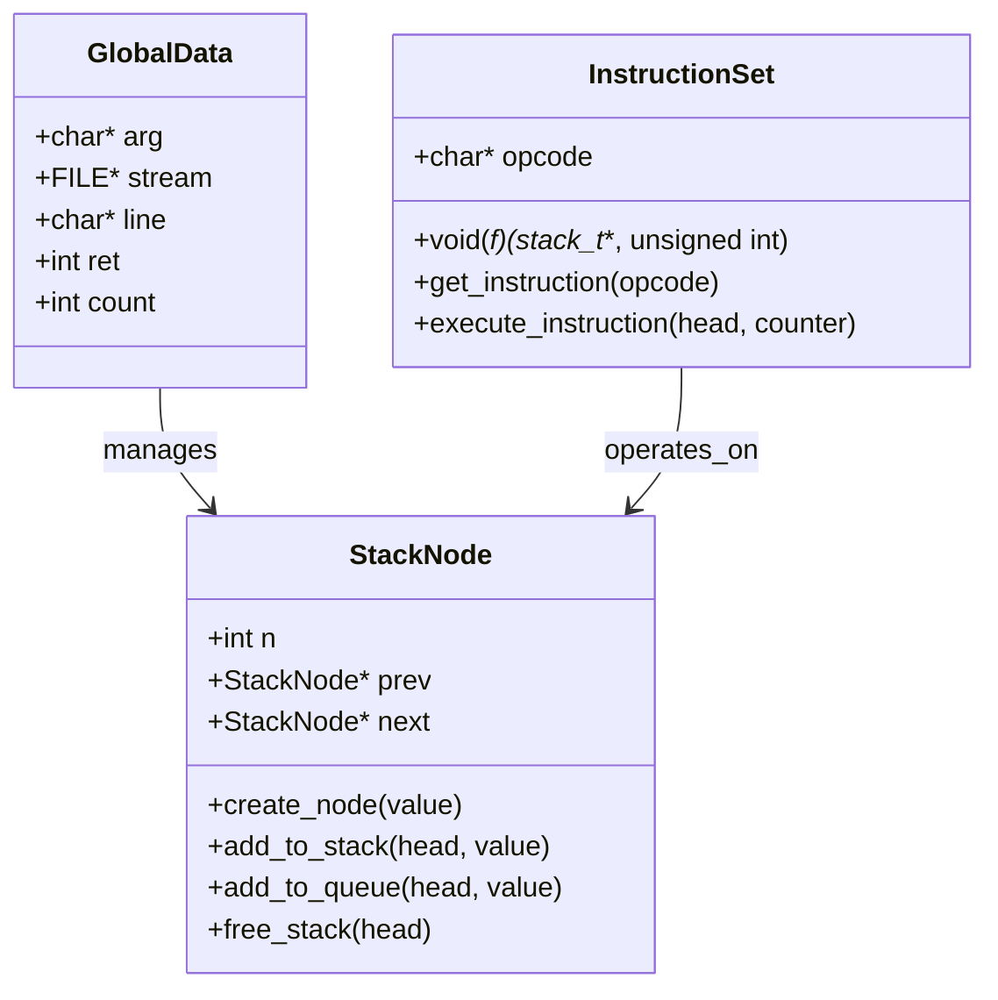

**Global State Management:**
- **data_t structure**: Centralized state for interpreter context
- **Stream handling**: File pointer for bytecode input
- **Mode tracking**: Stack vs queue operation mode
- **Error state**: Global error condition management

### Memory Layout Strategy
- **Doubly Linked List**: Efficient insertion/deletion at both ends
- **Dynamic Allocation**: Nodes allocated as needed with malloc
- **Memory Cleanup**: Automatic cleanup on errors and program termination
- **Pointer Safety**: Comprehensive null pointer checking

---

## 🔄 Execution Architecture

### Instruction Execution Flow
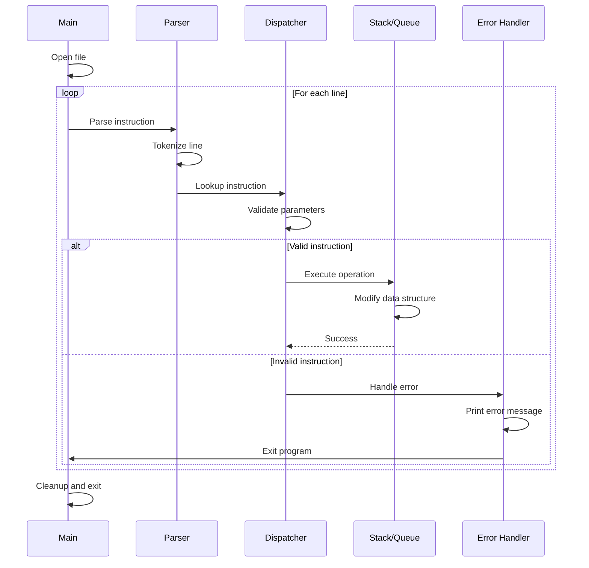

### Instruction Dispatch System
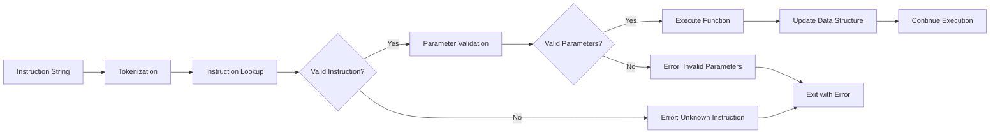

---

## ⚙️ Instruction Set Architecture

### Core Stack Operations
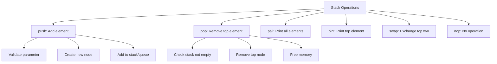

### Arithmetic Operations
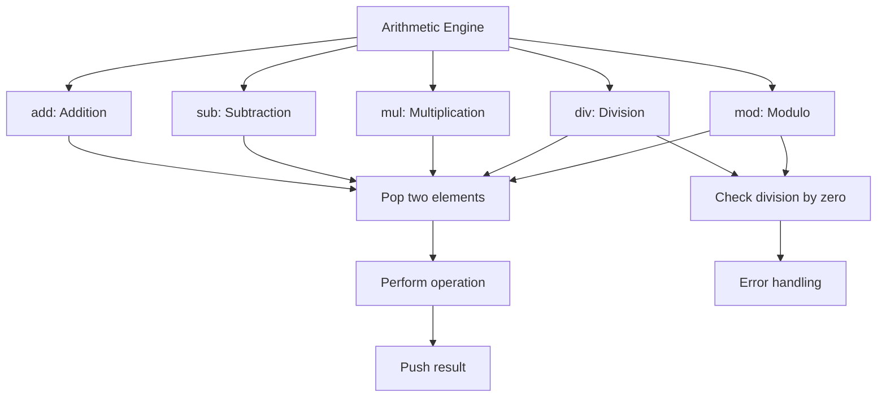

### I/O and Character Operations
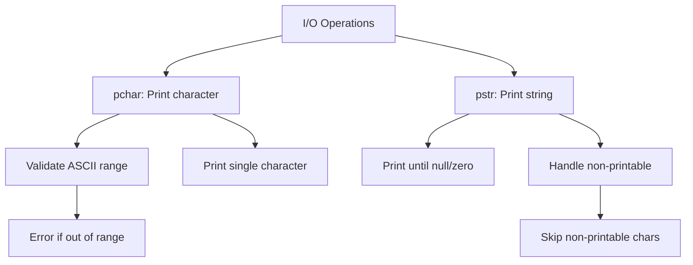

---

## 🔀 Mode Switching Architecture

### Stack vs Queue Behavior
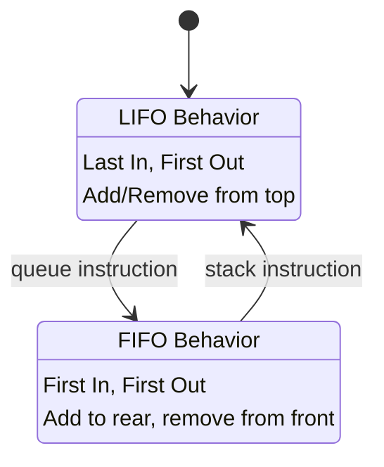

**Mode Implementation:**
- **Global flag**: `data.ret` controls current mode
- **Dynamic switching**: Instructions can change mode at runtime
- **Consistent interface**: Same operations, different behavior
- **State persistence**: Mode maintained across instructions

---

## 🧠 Brainf*ck Integration Architecture

### Brainf*ck Interpreter Components
```mermaid
graph TD
    A[Brainf*ck Program] --> B[Memory Tape]
    A --> C[Instruction Pointer]
    A --> D[Data Pointer]
    
    B --> E[30000 byte array]
    B --> F[Zero-initialized]
    
    C --> G[Program counter]
    C --> H[Loop stack]
    
    D --> I[Current cell pointer]
    D --> J[Bounds checking]
    
    subgraph "Operations"
        K[> < + - . , [ ]]
        L[Memory navigation]
        M[Value modification]
        N[I/O operations]
        O[Loop control]
    end
    
    E --> K
    G --> K
    I --> K
```

**Brainf*ck Features:**
- **Memory model**: 30,000-cell byte array
- **Instruction set**: 8 basic operations
- **Loop handling**: Bracket matching with stack
- **I/O integration**: Character input/output

---

## 🔐 Error Handling Architecture

### Comprehensive Error Management
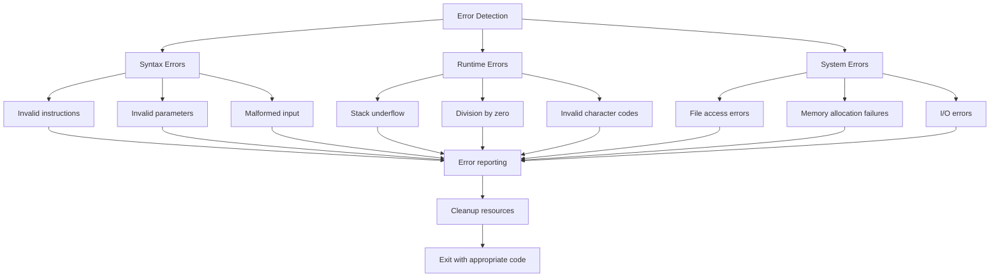

### Error Recovery Strategies
- **Graceful termination**: Clean resource cleanup on errors
- **Informative messages**: Clear error descriptions with line numbers
- **Resource management**: Automatic memory and file handle cleanup
- **Exit codes**: Appropriate program termination status

---

## 📊 Performance Architecture

### Memory Management Strategy
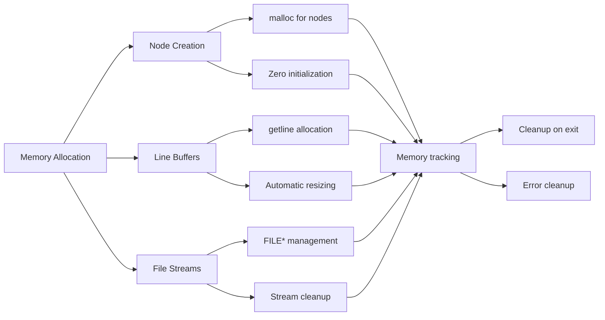

### Performance Optimizations
- **Efficient data structures**: Doubly linked list for O(1) operations
- **Memory pooling**: Reuse of allocated structures where possible
- **Stream processing**: Line-by-line processing for large files
- **Lazy evaluation**: Operations performed only when needed

---

## 🛠️ Build and Testing Architecture

### Compilation System
```bash
# Standard compilation
gcc -Wall -Wextra -Werror -pedantic -std=c90 *.c -o monty

# Debug compilation
gcc -g -Wall -Wextra -Werror -pedantic -std=c90 *.c -o monty

# Memory testing
valgrind --leak-check=full ./monty bytecode_file
```

### Testing Framework
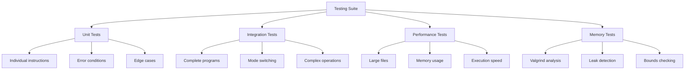

---

## 📁 Module Organization

### File Structure and Responsibilities
```
monty/
├── monty.h              # Global definitions and structures
├── monty.c              # Main interpreter and file processing
├── builtins1.c          # Core stack operations (push, pop, pall, pint)
├── builtins2.c          # Stack manipulation (swap, add, nop, sub)
├── builtins3.c          # Arithmetic operations (div, mul, mod)
├── builtins4.c          # I/O operations (pchar, pstr, rotl, rotr, queue, stack)
├── helpers.c            # Utility functions and validation
├── lists.c              # Data structure management
├── bf/                  # Brainf*ck interpreter implementation
├── checker/             # Test cases and validation
└── tester/              # Additional testing utilities
```

**Modular Design Benefits:**
- **Separation of concerns**: Each module has distinct responsibilities
- **Maintainability**: Easy to modify and extend individual components
- **Testability**: Independent testing of module functionality
- **Reusability**: Components can be reused in other projects

---

*This architecture documentation provides a comprehensive overview of the Monty interpreter system design, emphasizing the systematic approach to language implementation, data structure management, and software engineering excellence in systems programming.*
